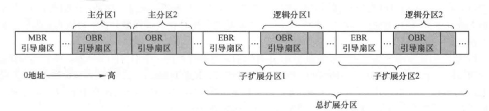

# 前序知识
## 一、基本8086汇编知识
详细学习参考**王爽《汇编语言》**

## 二、保护模式
可参考 **《x86汇编语言：从实模式到保护模式完整版》**

## 三、内存地址
- 物理地址：内存真正的地址，访问内存的最终途径
- 有效地址（逻辑地址）：段内偏移地址，与段基址/选择子共同构成物理地址
- 线性地址（虚拟地址）：保护模式下开启分页后，段基址+段内偏移得到虚拟地址，此地址需要通过页表转换成物理地址（物理地址不固定）

## 四、段寄存器
- **CPU内部段寄存器** 
 1. CS *(Code Segment)* 代码段寄存器，存储代码段的段基址
 2. DS *(Data Segment)* 数据段寄存器，存储数据段的段集址
 3. ES *(Extra Segment)* 附加段寄存器，存储附加数据段的段基址
 4. FS 附加段寄存器
 5. GS 附加段寄存器
 6. SS *(Stack Segment)* 堆栈段寄存器，存储堆栈段的段值
- **不同工作模式**
 1. 实模式：存储段基址，具体的物理地址
 2. 保护模式：存储段选择子，仍为16位宽度

## 五、字节序
- 小端字节序：数值的低字节放在内存的低地址处（x86结构）
    > 强制转换数据类型时无需再调整字节
- 大端字节序：数值低字节放在内存的高地址处（符合人类的阅读习惯）
    > 对于有符号数，符号位固定位第一字节，容易进行正负判断

## 六、中断
1. 中断向量表 *IVT* ：用于容纳中断处理例程的段基址和偏移地址。计算机启动时由BIOS建立，从0x0000处初始化并向其中添加各种处理例程
2. BIOS DOS 中断：都是基于中断向量表  
DOS中断只有0x21这个中断号，由ah寄存器提供子功能号
3. Linux中断：在保护模式下，中断向量表已经不存在，由中断描述符表 *IDT* 代替。

## 七、节Section 段Segment
- ### 节 *Section* 
  指asm源代码中由关键字 *section* 或 *segment* 修饰、逻辑划分的指令或数据区域，汇编器会将这些区域在目标文件中编译成节。诞生于目标文件。
- ### 段 *Segment* 
  指链接器根据目标文件中属性相同的多个section合并后的section集合，这个集合也就是段。诞生于可执行文件。
- ### 标准的section名

  | 节名 | 说明 | 
  | :----: | :----: |
  | .data | 存入数据，可读可写 |
  | .text | 存入代码，只读可执行 |
  | .bss | 全局未初始化区域 |

## 八、指令集、体系结构、微架构、编程语言
- ### 指令集
  CPU所处理的指令的集合，由设计时人为规定并用于指挥CPU。指令集是一套约定，里面规定的是有哪些指令、指令的二进制编码、指令格式等。

  > CISC *Complex Instruction Set Computer* 复杂指令集计算机  
  > RISC *Reduced Instruction Set Computer* 简单指令集计算机

- ### 微架构
  完成指令集的物理实现方式

- ### 编程语言
  由编译器按照CPU的指令集翻译成符合该CPU的指令  
  **交叉编译** ：运用A平台上的编译器编译出B平台上能运行的CPU指令集程序

## 八、MBR、EBR、DBR、OBR  
  > 围绕计算机系统的控制权展开
  - ### 计算机加电
    运行BIOS
  - ### MBR *Master/Main Boot Record* 主引导记录
    由BIOS在固定位置（硬盘最开始的扇区，CHS方式表示为 **0盘0道1扇区** ，称为MBR引导扇区）找到，并把MBR中的引导程序加载到物理地址 **0x7c00** 中，然后改变PC跳转执行。

    MBR内容包括  
    >1. 446字节的引导程序及参数  
    >2. 64字节的分区表（可容纳4个分区，每个分区占16字节）  
    >3. 2字节结束标记 0x55和0xaa  
    
    MBR引导程序遍历分区表中的4个分区，寻找“次引导程序”。
  - ### OBR *OS Boot Record* 操作系统引导记录
    通常该次引导程序就是操作系统的加载器。为了让MBR找到该程序，需要在分区时将安装OS的分区设置为**活动分区**。

    设置活动分区本质是把分区表中该分区对应的分区表项中的活动标记设置为0x80。活动分区标记位于分区表项最开始的1字节，其值为0x80或0。当MBR寻找到活动分区时，就将CPU使用权交给此分区上的引导程序，此程序通常为内核加载器。

    为方便寻找到内核加载器，该程序的入口地址位于分区开始的扇区，该扇区被称为操作系统引导扇区。其中的引导程序被称为OBR，该扇区也被称为OBR引导扇区。OBR引导扇区的前3个字节存放跳转指令，该指令将CPU带入操作系统的引导程序。

    OBR中的跳转指令目的地址并不固定，由文件系统决定。对于FAT32文件系统，跳转至本扇区偏移0x5A字节的操作系统引导程序处。

  - ### DBR *DOS Boot Record* DOS操作系统引导记录
    > DBR是OBR的前身
    
    DBR中的内容大概包括
    >1. 跳转指令，使MBR跳转到引导代码
    >2. 厂商信息、DOS版本信息
    >3. BIOS参数块BPB *BIOS Parameter Block*
    >4. 操作系统引导程序
    >5. 结束标记0x55和0xaa

  - ### EBR *Expand Boot Record* 扩展引导记录
    为解决MBR的4分区上限，提出了扩展分区的概念。而EBR是扩展分区中兼容MBR的部分。EBR与MBR结构相同，只是位置不同。位于各子扩展分区中最开始的扇区。

  - ### MBR、EBR、OBR的关系
  

## 九、总结
**三个前置知识 四次跳跃**

三个**前置知识**：

1. 内存是存储数据的地方，给出一个地址信号，内存可以返回该地址所对应的数据。
2. CPU 的工作方式就是不断从内存中取出指令，并执行。
3. CPU 从内存的哪个地址取出指令，是由一个寄存器中的值决定的，这个值会不断进行 +1 操作，或者由某条跳转指令指定其值是多少。

计算机开机后的四次**关键跳跃**：

1. 按下开机键，CPU 将 PC 寄存器的值强制初始化为 0xffff0，这个位置是 BIOS 程序的入口地址（**一跳**）
2. 该入口地址处是一个跳转指令，跳转到 0xfe05b 位置，开始执行（**二跳**）
3. 执行了一些硬件检测工作后，最后一步将启动区内容加载（复制）到内存 0x7c00，并跳转到这里（**三跳**）
4. 启动区代码主要是加载操作系统内核，并跳转到加载处（**四跳**）