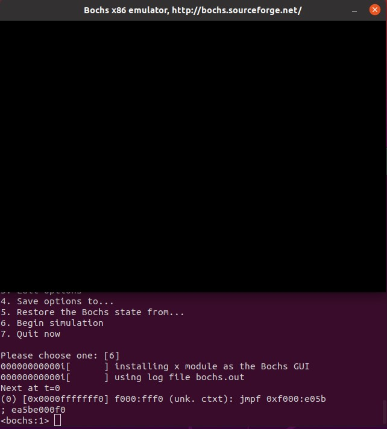

# 部署工作环境(Linux)
## 一、编译器准备
1. C语言：gcc  
   Linux中自带GCC
2. 汇编：nasm
   ```shell
   sudo apt-get install nasm
   ```
   汇编用于与底层硬件交互，运用于硬件访问、中断调用、端口读写、线程切换等
## 二、宿主环境
运用虚拟机简化调试

VMware+Ubuntu20.04虚拟化Linux，在linux下的bochs中调试运行操作系统

安装编译相关软件
```shell
sudo apt-get install build-essential
sudo apt-get install xorg-dev
sudo apt-get install bison
sudo apt-get install libgtk2.0-dev
sudo apt-get install g++
```
解压源代码
```shell
sudo tar zxvf bochs-2.6.11.tar.gz
cd bochs-2.6.11
```
运行configure脚本 **prefix为安装路径**
```shell
./configure --prefix=/home/.../bochs --enable-debugger --enable-disasm --enable-iodebug --enable-x86-debugger --with-x --with-x11
```
编译
```shell
make clean
sudo make
```
安装
```shell
sudo make install 
```
## 三、配置bochs
配置文件，可放置安装路径下的bin文件夹内
**bochsrc.disk**
```
megs: 32

romimage: file=/home/co/bochs/share/bochs/BIOS-bochs-latest
vgaromimage: file=/home/co/bochs/share/bochs/VGABIOS-lgpl-latest
mouse: enabled=0

boot: disk

log: bochs.out

mouse: enabled=0

keyboard: enabled=1,keymap=/home/co/bochs/share/bochs/keymaps/x11-pc-us.map

ata0: enabled=1, ioaddr1=0x1f0, ioaddr2=0x3f0, irq=14
ata0-master: type=disk, path="hd60M.img", mode=flat
#, cylinders=121, heads=16, spt=63
#ata0-slave: type=disk, path="hd80M.img", mode=flat, cylinders=162, heads=16, spt=63

```
创建软盘（hd,flat,60M hd60M.img）
```shell
cd bin
bximage
```
并修改配置文件
## 四、运行bochs
```shell
cd /home/.../bochs/bin
./bochs
```
选择[2] 并输入配置文件名 *bochsrc.disk*  
选择[6] 运行


# 部署工作环境(Win64)
## 一、nasm安装
> 下载nasm：https://www.nasm.us/pub/nasm/releasebuilds  
> 配置环境变量（安装目录） C:\Program Files\NASM
## 二、gcc安装
> 下载MinGW：http://sourceforge.net/projects/mingw/files/  
> 配置环境变量（安装目录） D:\MinGw\bin  
> cmd中执行：  
```cmd
mingw-get install gcc
```
可同时安装g++与gdb
## 三、bochs安装
> 下载bochs-win64 https://sourceforge.net/projects/bochs/files/bochs/2.6.11/
> 安装目录 C:\Program Files\Bochs-2.6.11