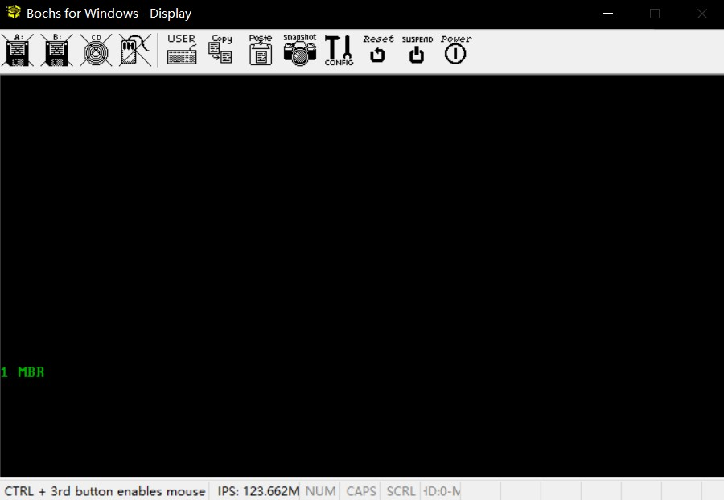

# 编写MBR主引导记录
## 一、BIOS
### 1. 实模式下的1MB内存布局

### 2. 加电启动
当前指令位置：f000:fff0 ( *0xffff0* BIOS入口地址)  
当前指令: jmpf f000:e05b  ( *0xfe05b* BIOS代码开始处)


## 二、MBR
> MBR大小必须是512字节，为了保证0x55与0xaa在该扇区最后两个字节处（小端字节序：AA（高位）+55（低位）=0xaa55）

MBR程序：打印“1 MBR”
```asm {.line-numbers}
;主引导程序 
;------------------------------------------------------------
SECTION MBR vstart=0x7c00;vstart：告诉编译器后面的代码以0x7c00为基准计算其他地址，用于其他程序将该程序加载到0x7c00后的正常使用       
   mov ax,cs      
   mov ds,ax
   mov es,ax
   mov ss,ax
   mov fs,ax
   mov sp,0x7c00

; 清屏 利用0x06号功能，上卷全部行，则可清屏。
; -----------------------------------------------------------
;INT 0x10   功能号:0x06	   功能描述:上卷窗口
;------------------------------------------------------
;输入：
;AH 功能号= 0x06
;AL = 上卷的行数(如果为0,表示全部)
;BH = 上卷行属性
;(CL,CH) = 窗口左上角的(X,Y)位置
;(DL,DH) = 窗口右下角的(X,Y)位置
;无返回值：
   mov     ax, 0x600
   mov     bx, 0x700
   mov     cx, 0            ; 左上角: (0, 0)
   mov     dx, 0x184f       ; 右下角: (80,25),
			                ; VGA文本模式中,一行只能容纳80个字符,共25行。
			                ; 下标从0开始,所以0x18=24,0x4f=79
   int     0x10             ; int 0x10

;;;;;;;;;    下面这三行代码是获取光标位置    ;;;;;;;;;
;.get_cursor获取当前光标位置,在光标位置处打印字符.
   mov ah, 3                ; 输入: 3号子功能是获取光标位置,需要存入ah寄存器
   mov bh, 0		        ; bh寄存器存储的是待获取光标的页号

   int 0x10	                ; 输出: ch=光标开始行,cl=光标结束行
                            ; dh=光标所在行号,dl=光标所在列号

;;;;;;;;;    获取光标位置结束    ;;;;;;;;;;;;;;;;

;;;;;;;;;     打印字符串    ;;;;;;;;;;;
   ;还是用10h中断,不过这次是调用13号子功能打印字符串
   mov ax, message 
   mov bp, ax               ; es:bp 为串首地址, es此时同cs一致，
                            ; 开头时已经为sreg初始化

   ; 光标位置要用到dx寄存器中内容,cx中的光标位置可忽略
   mov cx, 5                ; cx 为串长度,不包括结束符0的字符个数
   mov ax, 0x1301	        ; 子功能号13是显示字符及属性,要存入ah寄存器,
			                ; al设置写字符方式 ah=01: 显示字符串,光标跟随移动
   mov bx, 0x2		        ; bh存储要显示的页号,此处是第0页,
			                ; bl中是字符属性, 属性黑底绿字(bl = 02h)
   int 0x10	
;;;;;;;;;      打字字符串结束	 ;;;;;;;;;;;;;;;

   jmp $                    ; 使程序悬停在此

   message db "1 MBR"
   times 510-($-$$) db 0
   db 0x55,0xaa
```
编译并写入img
```cmd
nasm -o mbr.bin mbr.asm
dd if=mbr.bin of=hd60M.img bs=512 count=1 conv=notrunc
```

成功运行并显示

