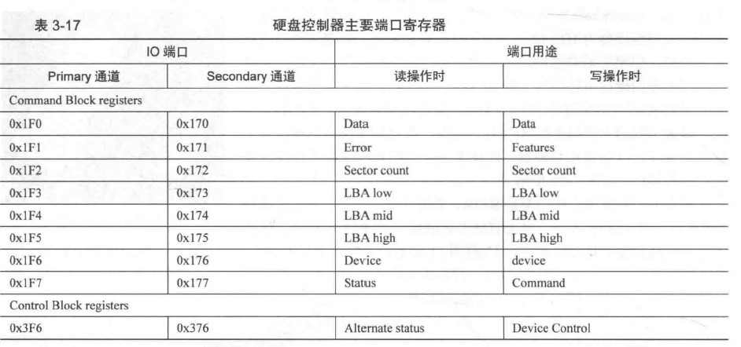

# 完善MBR
## 一、操作显卡
显存文本模式中，内存地址为0xb8000
```ams
;主引导程序 
;
;LOADER_BASE_ADDR equ 0xA000 
;LOADER_START_SECTOR equ 0x2
;------------------------------------------------------------
SECTION MBR vstart=0x7c00         
   mov ax,cs      
   mov ds,ax
   mov es,ax
   mov ss,ax
   mov fs,ax
   mov sp,0x7c00
   mov ax,0xb800
   mov gs,ax

; 清屏
;利用0x06号功能，上卷全部行，则可清屏。
; -----------------------------------------------------------
;INT 0x10   功能号:0x06	   功能描述:上卷窗口
;------------------------------------------------------
;输入：
;AH 功能号= 0x06
;AL = 上卷的行数(如果为0,表示全部)
;BH = 上卷行属性
;(CL,CH) = 窗口左上角的(X,Y)位置
;(DL,DH) = 窗口右下角的(X,Y)位置
;无返回值：
   mov     ax, 0600h
   mov     bx, 0700h
   mov     cx, 0               ; 左上角: (0, 0)
   mov     dx, 184fh	       ; 右下角: (80,25),
			       ; 因为VGA文本模式中，一行只能容纳80个字符,共25行。
			       ; 下标从0开始，所以0x18=24,0x4f=79
   int     10h                 ; int 10h

   ; 输出背景色绿色，前景色红色，并且跳动的字符串"1 MBR"
   mov byte [gs:0x00],'1'
   mov byte [gs:0x01],0xA4     ; A表示绿色背景闪烁，4表示前景色为红色

   mov byte [gs:0x02],' '
   mov byte [gs:0x03],0xA4

   mov byte [gs:0x04],'M'
   mov byte [gs:0x05],0xA4   

   mov byte [gs:0x06],'B'
   mov byte [gs:0x07],0xA4

   mov byte [gs:0x08],'R'
   mov byte [gs:0x09],0xA4

   jmp $		       ; 通过死循环使程序悬停在此

   times 510-($-$$) db 0
   db 0x55,0xaa
```
## 二、操作硬盘
### 1.主要端口

**data寄存器**(16位)：读写硬盘数据  
**error寄存器**(8位)：读硬盘时记录读取失败信息  
**feature寄存器**(8位)：写硬盘时的额外参数  
**sector count寄存器**(8位)：指定待读取或待写入的扇区（剩余扇区数）  
**LBA**：逻辑块地址，LBA28（28位描述一个扇区）
  - LBA low寄存器：LBA 0~7位
  - LBA mid寄存器：LBA 8~15位
  - LBA high寄存器：LBA 16~23位

**device寄存器**(8位)：低位：LBA 24~27位；第4位：指定该通道的主盘0或从盘1；第6位：启动LBA模式1，启动CHS模式0；第5位和第7位：MBS位，固定为1  
**command寄存器**(8位)：写硬盘时的指令  
  - 0xec：硬盘识别
  - 0x20：读扇区
  - 0x30：写扇区

**status寄存器**(8位)：读硬盘时的状态信息
  - 第0位：EER位（错误1），具体原因可见error寄存器
  - 第3位：data request位，为1表示硬盘已经准备好数据，可供读取
  - 第6位：DRDY位，为1表示硬盘就绪，等待指令
  - 第7位：BSY位，为1表示硬盘忙，忽略其他指令

### 2.使用硬盘
1. 先选择通道，往该通道的*sector count*寄存器中写入待操作的扇区数
2. 往该通道上的三个*LBA*写入扇区起始地址的低24位
3. 往*device*寄存器中写入LBA地址的24~27位，并置第6位为1，使其为LBA模式，设置第四位，选择操作的硬盘
4. 往该通道上的*command*寄存器写入操作命令
5. 读取该通道上的*status*寄存器，判断硬盘工作是否完成
6. 对于写硬盘：完成；对于读硬盘：读取硬盘数据
7. 选择**查询传送方式**或**中断传送方式**读取数据

## 三、改造MBR
> 确定任务：从硬盘上把loader加载到内存，并转移CPU的使用权  
> 
> loader加载位置：实模式内存中0x500~0x7BFF，0x7e00~0x9fbff都为可用区域
