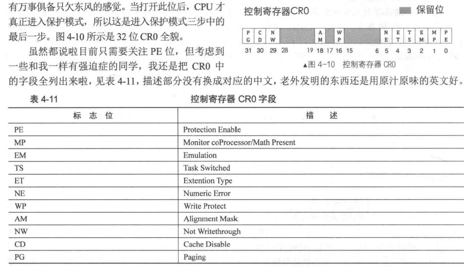

# 保护模式入门
## 一、保护模式介绍
### 1. 寄存器宽度提升 
  寄存器宽度提升到32位，访问4GB空间


### 2. 选择子
  段基地址被选择子替代，选择子用来索引全局描述符表中的段描述符。  
  全局描述符表存储于内存中，由GDTR寄存器指向

### 3. 寻址扩展
  基址寄存器可使用所有32位的通用寄存器，变址寄存器可使用除esp之外的所有32位寄存器。  
  可以对变址寄存器乘以一个比例因子（1、2、4、8）

  

### 4. 运行模式反转
  使用伪指令 *[bits 16]* 和 *[bits 32]* (中括号可省略，默认为 bits 16) 指定运行模式  
  操作数大小反转前缀*0x66*和寻址方式反转前缀*0x67*，用于临时将当前运行模式下的操作数大小和寻址方式转变成另外一种模式下的操作数大小和寻址方式
### 5. 指令扩展
  - **mul/imul**  
    - 乘数是8位，把*al*当成另一个乘数，结果为16位，存入*ax*  
    - 乘数是16位，把*ax*当成另一个乘数，结果为32位，存入*eax*  
    - 乘数是32位，把*eax*当成另一个乘数，结果为64位，存入*edx(H),eax(L)*  
  - **div**  
    - 除数8位，被除数*ax*，商*al*余数*ah*  
    - 除数16位，被除数*ax(L),dx(H)*，商*ax*余数*dx*  
    - 除数32位，被除数*eax(L),edx(H)*,商*eax*余数*edx*  
  - **push**  
    push不会压入一个字节，它要么压入字，要么压入双字

    **总结**
    > 4.1_3.jpg,4.1_4.jpg引自 [16位模式/32位模式下PUSH指令探究——《x86汇编语言：从实模式到保护模式》读书笔记16](https://blog.csdn.net/longintchar/article/details/50602851)

    

    

    1. 立即数
        - 8位：扩展为默认操作数宽度后入栈（实模式es-2，保护模式esp-4）
        - 16位(*word*修饰)：实模式下直接入栈，sp-2；保护模式下直接入栈，esp-2
        - 32位(*dword*修饰)：实模式下直接入栈，sp-4；保护模式下入栈，esp-4
    2. 段寄存器
        - 实模式：入栈，sp-2
        - 保护模式：入栈，esp-4
## 二、进入保护模式前的准备
### 1. 段描述符(8字节)

  **高32位**
  |位数|作用|
  |:-:|:-:|
  |31~24|段基址 *31~24*|
  |23|G|
  |22|D/B|
  |21|L|
  |20|AVL|
  |19~16|段界限 *19~16*|
  |15|P|
  |14~13|DPL|
  |12|S|
  |11~8|TYPE|
  |7~0|段基址 *23~16*|

  **低32位**
  |位数|作用|
  |:-:|:-:|
  |31~16|段基址 *15~0*|
  |15~0|段界限 *15~0*|

  - 段基址：32位

  - 段界限：20位，表示段边界的扩展最值。对于数据段和代码段，段扩展方向向上，地址越来越大，段界限表示段内偏移的最大值。对于栈段，段扩展方向向下，地址越来越小，段界限表示段内偏移的最小值。单位由G位决定  
  **实际段界限边界值** =（**描述符中的段界限** *(段界限从0开始计算)* +**1**）\*（**段界限的粒度大小**：4KB或1）-**1** *(地址从0计算)*

  - S: 段描述符分类 0:系统段 1:数据段

  - TYPE：系统段略，非系统段
  
  
    - A: *Accessed* 创建新段描述符时置0，CPU访问过后自动置1
    - C: *Conforming* 一致性代码段/依从代码段 
  
      对于一致代码段，也就是共享的段：特权级高的程序不允许访问特权级低的数据，特权级低的程序可以访问到特权级高的数据，但是特权级不会改变。

      对于普通代码段，也就是非一致代码段：只允许同级间访问，绝对禁止不同级访问。
    - R：*Readable* 可读性
    - X：*Executable* 可执行性
    - E：*Extend* 扩展方向 0:向上扩展（代码段与数据段） 1:向下扩展（栈段）
    - W：*Writable* 可写性
  - DPL：*Descriptor Privilege Level* 描述符特权级
    0、1、2、3 操作系统位于最高特权的0特权级，用户程序通常处于最低权限的3特权级
  - P：*Present* 是否存在
  - AVL：*Available* 用户可用性
  - L：是否是64位代码段，32位编程置0
  - D/B：对于代码段，此位为D位。0表示指令中的有效地址和操作数位16位，有效地址用IP存储；1表示为32为，有效地址用EIP存储。对于数据段，此位为B位，用来指定操作数的大小，此操作数涉及到栈指针寄存器的选择和栈的地址上限。0表示使用sp寄存器，栈的起始地址是16位寄存器的最大寻址范围0xFFFF；1表示使用esp寄存器，栈的起始地址是32位寄存器的最大寻址范围0xFFFFFFFF
  - G：*Granularity* 粒度，用来指定段界限的单位大小。0：1字节，1：4KB
### 2. 全局描述符表*GDT* 局部描述符表*LDT* 选择子 *Selector*
  - GDT 
    全局体现在多个程序都可以在里面定义自己的段描述符，是公用的。使用GDTR寄存器(48位)存储GDT的内存地址(16~47位)和大小(0~15位，GDT的字节大小-1)  
    lgdt指令用于初始化GDTR，格式:lgdt 48位内存数据
  - 选择子
    选择子和段寄存器同样是16位.第0~1位用来存储RPL请求特权级*Request Privilege Level*，可以表示0、1、2、3四种特权级。第2位是TI位*Table Indicator*，用来指示选择子是在GDT（0）中还是LDT（1）中索引描述符。第3~15位是描述符的索引值。  
    选择子未初始化时默认指向第0描述符，该描述符一般不使用
    选择子在GDT/LDT中确定段描述符，段描述符确定段基地址，使用段基地址直接加上偏移地址得到访存地址。
  - LDT
    LDT在系统中可以存在多个，而且不是全局可见的，它们只对引用它们的任务可见，每个任务最多可以拥有一个LDT。另外，每一个LDT自身作为一个段存在，它们的段描述符被放在GDT中。  
    lldt指令用于初始化LDTR，格式：lldt 16位寄存器/16位内存
### 3. 打开A20地址线
    在实模式下，只能使用A0~A19 20位地址线。使用A20Gate控制A20地址线。  
    打开A20Gate：将0x92端口第1位置1  
    ```asm
    in al,0x92
    or al,00000010b
    out 0x92,al
    ```
### 4. 切换CR0寄存器的PE位

  
  ```asm
  mov eax,cr0
  or cr0,1
  mov cr0,eax
  ```

## 三、进入保护模式
### 1. 修改MBR
  ```asm
  mov cx,4 ;loader较大，需写入4个扇区
  call rd_disk_m_16
  ```
### 2. 更新boot.int
```asm
    ;-------------	 loader和kernel   ----------
    LOADER_BASE_ADDR equ 0x500 
    LOADER_START_SECTOR equ 0x2

    ;--------------   gdt描述符属性  -------------
    DESC_G_4K   equ	  1_00000000000000000000000b   
    DESC_D_32   equ	   1_0000000000000000000000b
    DESC_L	    equ	    0_000000000000000000000b	;  64位代码标记，此处标记为0便可。
    DESC_AVL    equ	     0_00000000000000000000b	;  cpu不用此位，暂置为0  
    DESC_LIMIT_CODE2  equ 1111_0000000000000000b
    DESC_LIMIT_DATA2  equ DESC_LIMIT_CODE2
    DESC_LIMIT_VIDEO2  equ 0000_000000000000000b
    DESC_P	    equ		  1_000000000000000b
    DESC_DPL_0  equ		   00_0000000000000b
    DESC_DPL_1  equ		   01_0000000000000b
    DESC_DPL_2  equ		   10_0000000000000b
    DESC_DPL_3  equ		   11_0000000000000b
    DESC_S_CODE equ		     1_000000000000b
    DESC_S_DATA equ	  DESC_S_CODE
    DESC_S_sys  equ		     0_000000000000b
    DESC_TYPE_CODE  equ	      1000_00000000b	;x=1,c=0,r=0,a=0 代码段是可执行的,非依从的,不可读的,已访问位a清0.  
    DESC_TYPE_DATA  equ	      0010_00000000b	;x=0,e=0,w=1,a=0 数据段是不可执行的,向上扩展的,可写的,已访问位a清0.

    DESC_CODE_HIGH4 equ (0x00 << 24) + DESC_G_4K + DESC_D_32 + DESC_L + DESC_AVL + DESC_LIMIT_CODE2 + DESC_P + DESC_DPL_0 + DESC_S_CODE + DESC_TYPE_CODE + 0x00
    DESC_DATA_HIGH4 equ (0x00 << 24) + DESC_G_4K + DESC_D_32 + DESC_L + DESC_AVL + DESC_LIMIT_DATA2 + DESC_P + DESC_DPL_0 + DESC_S_DATA + DESC_TYPE_DATA + 0x00
    DESC_VIDEO_HIGH4 equ (0x00 << 24) + DESC_G_4K + DESC_D_32 + DESC_L + DESC_AVL + DESC_LIMIT_VIDEO2 + DESC_P + DESC_DPL_0 + DESC_S_DATA + DESC_TYPE_DATA + 0x0b

    ;--------------   选择子属性  ---------------
    RPL0  equ   00b
    RPL1  equ   01b
    RPL2  equ   10b
    RPL3  equ   11b
    TI_GDT	 equ   000b
    TI_LDT	 equ   100b
 ```
### 3. 创建loader
```asm
%include "boot.inc"
section loader vstart=LOADER_BASE_ADDR
LOADER_STACK_TOP equ LOADER_BASE_ADDR
jmp loader_start
   
;构建gdt及其内部的描述符
GDT_BASE:
   dd 0x00000000 
   dd 0x00000000
CODE_DESC:
   dd 0x0000FFFF 
   dd DESC_CODE_HIGH4
DATA_STACK_DESC:
   dd 0x0000FFFF
   dd DESC_DATA_HIGH4
VIDEO_DESC:
   dd 0x80000007	       ;limit=(0xbffff-0xb8000)/4k=0x7
	dd DESC_VIDEO_HIGH4  ; 此时dpl已改为0

GDT_SIZE    equ   $ - GDT_BASE
GDT_LIMIT   equ   GDT_SIZE -	1 
times 60 dq 0					 ; 此处预留60个描述符的slot
SELECTOR_CODE equ (0x0001<<3) + TI_GDT + RPL0         ; 相当于(CODE_DESC - GDT_BASE)/8 + TI_GDT + RPL0
SELECTOR_DATA equ (0x0002<<3) + TI_GDT + RPL0	 ; 同上
SELECTOR_VIDEO equ (0x0003<<3) + TI_GDT + RPL0	 ; 同上 

;以下是定义gdt的指针，前2字节是gdt界限，后4字节是gdt起始地址

gdt_ptr  dw  GDT_LIMIT 
dd  GDT_BASE
loadermsg db '2 loader in real.'

loader_start:
;------------------------------------------------------------
;INT 0x10    功能号:0x13    功能描述:打印字符串
;------------------------------------------------------------
;输入:
;AH 子功能号=13H
;BH = 页码
;BL = 属性(若AL=00H或01H)
;CX＝字符串长度
;(DH、DL)＝坐标(行、列)
;ES:BP＝字符串地址 
;AL＝显示输出方式
;   0——字符串中只含显示字符，其显示属性在BL中。显示后，光标位置不变
;   1——字符串中只含显示字符，其显示属性在BL中。显示后，光标位置改变
;   2——字符串中含显示字符和显示属性。显示后，光标位置不变
;   3——字符串中含显示字符和显示属性。显示后，光标位置改变
;无返回值
   mov sp, LOADER_BASE_ADDR
   mov bp, loadermsg    ; ES:BP = 字符串地址
   mov cx, 17			   ; CX = 字符串长度
   mov ax, 0x1301		   ; AH = 13,  AL = 01h
   mov bx, 0x001f		   ; 页号为0(BH = 0) 蓝底粉红字(BL = 1fh)
   mov dx, 0x1800		   ;
   int 0x10             ; 10h 号中断

;----------------------------------------   准备进入保护模式   ------------------------------------------
									;1 打开A20
									;2 加载gdt
									;3 将cr0的pe位置1


   ;-----------------  打开A20  ----------------
   in al,0x92
   or al,0000_0010B
   out 0x92,al
   ;-----------------  加载GDT  ----------------
   lgdt [gdt_ptr]
   ;-----------------  cr0第0位置1  ----------------
   mov eax, cr0
   or eax, 0x00000001
   mov cr0, eax
   jmp  SELECTOR_CODE:p_mode_start      ; 刷新流水线，避免分支预测的影响,这种cpu优化策略，最怕jmp跳转，
                                       ; 这将导致之前做的预测失效，从而起到了刷新的作用。

[bits 32]
p_mode_start:
   mov ax, SELECTOR_DATA
   mov ds, ax
   mov es, ax
   mov ss, ax
   mov esp,LOADER_STACK_TOP
   mov ax, SELECTOR_VIDEO
   mov gs, ax

   mov byte [gs:160], 'P'

   jmp $

```