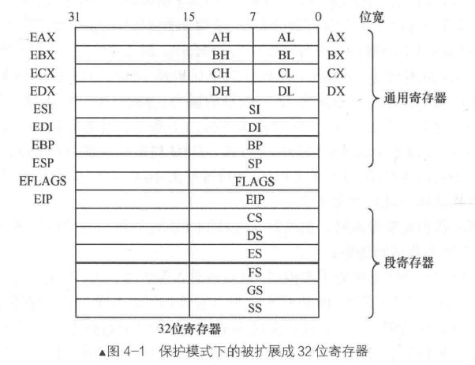
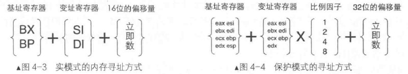
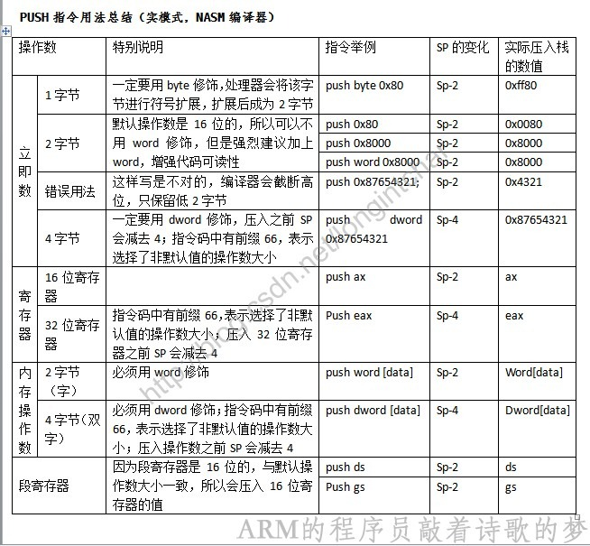
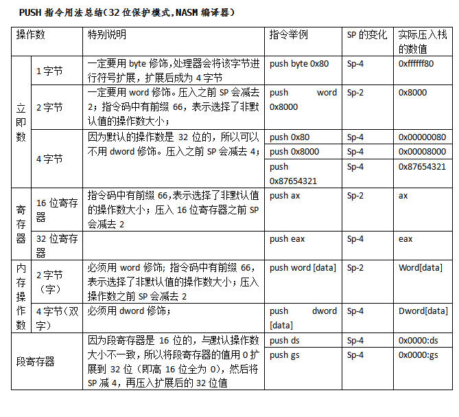
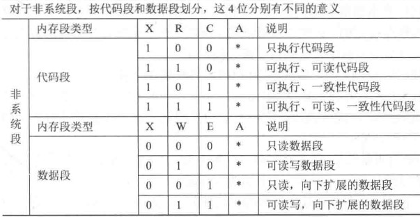

# 保护模式入门
## 一、保护模式介绍
### 1. 寄存器宽度提升 
  寄存器宽度提升到32位，访问4GB空间

### 2. 选择子
  段基地址被选择子替代，选择子用来索引全局描述符表中的段描述符。  
  全局描述符表存储于内存中，由GDTR寄存器指向

### 3. 寻址扩展
  基址寄存器可使用所有32位的通用寄存器，变址寄存器可使用除esp之外的所有32位寄存器。  
  可以对变址寄存器乘以一个比例因子（1、2、4、8）
  

### 4. 运行模式反转
  使用伪指令 *[bits 16]* 和 *[bits 32]* (中括号可省略，默认为 bits 16) 指定运行模式  
  操作数大小反转前缀*0x66*和寻址方式反转前缀*0x67*，用于临时将当前运行模式下的操作数大小和寻址方式转变成另外一种模式下的操作数大小和寻址方式
### 5. 指令扩展
  - **mul/imul**  
    - 乘数是8位，把*al*当成另一个乘数，结果为16位，存入*ax*  
    - 乘数是16位，把*ax*当成另一个乘数，结果为32位，存入*eax*  
    - 乘数是32位，把*eax*当成另一个乘数，结果为64位，存入*edx(H),eax(L)*  
  - **div**  
    - 除数8位，被除数*ax*，商*al*余数*ah*  
    - 除数16位，被除数*ax(L),dx(H)*，商*ax*余数*dx*  
    - 除数32位，被除数*eax(L),edx(H)*,商*eax*余数*edx*  
  - **push**  
    push不会压入一个字节，它要么压入字，要么压入双字

    **总结**
    > 4.1_3.jpg,4.1_4.jpg引自 [16位模式/32位模式下PUSH指令探究——《x86汇编语言：从实模式到保护模式》读书笔记16](https://blog.csdn.net/longintchar/article/details/50602851)
    
    

    1. 立即数
        - 8位：扩展为默认操作数宽度后入栈（实模式es-2，保护模式esp-4）
        - 16位(*word*修饰)：实模式下直接入栈，sp-2；保护模式下直接入栈，esp-2
        - 32位(*dword*修饰)：实模式下直接入栈，sp-4；保护模式下入栈，esp-4
    2. 段寄存器
        - 实模式：入栈，sp-2
        - 保护模式：入栈，esp-4
## 二、全局描述符表 GDT *Global Descriptor Table*
### 1. 段描述符(8字节)

  **高32位**
  |位数|作用|
  |:-:|:-:|
  |31~24|段基址 *31~24*|
  |23|G|
  |22|D/B|
  |21|L|
  |20|AVL|
  |19~16|段界限 *19~16*|
  |15|P|
  |14~13|DPL|
  |12|S|
  |11~8|TYPE|
  |7~0|段基址 *23~16*|

  **低32位**
  |位数|作用|
  |:-:|:-:|
  |31~16|段基址 *15~0*|
  |15~0|段界限 *15~0*|

  - 段基址：32位

  - 段界限：20位，表示段边界的扩展最值。对于数据段和代码段，段扩展方向向上，地址越来越大，段界限表示段内偏移的最大值。对于栈段，段扩展方向向下，地址越来越小，段界限表示段内偏移的最小值。单位由G位决定  
  **实际段界限边界值** =（**描述符中的段界限** *(段界限从0开始计算)* +**1**）\*（**段界限的粒度大小**：4KB或1）-**1** *(地址从0计算)*

  - S: 段描述符分类 0:系统段 1:数据段

  - TYPE：系统段略，非系统段
  
    - A: *Accessed* 创建新段描述符时置0，CPU访问过后自动置1
    - C: *Conforming* 一致性代码段/依从代码段 
  
      对于一致代码段，也就是共享的段：特权级高的程序不允许访问特权级低的数据，特权级低的程序可以访问到特权级高的数据，但是特权级不会改变。

      对于普通代码段，也就是非一致代码段：只允许同级间访问，绝对禁止不同级访问。
    - R：*Readable* 可读性
    - X：*Executable* 可执行性
    - E：*Extend* 扩展方向 0:向上扩展（代码段与数据段） 1:向下扩展（栈段）
    - W：*Writable* 可写性
  - DPL：*Descriptor Privilege Level* 描述符特权级
    0、1、2、3 操作系统位于最高特权的0特权级，用户程序通常处于最低权限的3特权级
  - P：*Present* 是否存在
  - AVL：*Available* 用户可用性
  - L：是否是64位代码段，32位编程置0
  - D/B：对于代码段，此位为D位。0表示指令中的有效地址和操作数位16位，有效地址用IP存储；1表示为32为，有效地址用EIP存储。对于数据段，此位为B位，用来指定操作数的大小，此操作数涉及到栈指针寄存器的选择和栈的地址上限。0表示使用sp寄存器，栈的起始地址是16位寄存器的最大寻址范围0xFFFF；1表示使用esp寄存器，栈的起始地址是32位寄存器的最大寻址范围0xFFFFFFFF
  - G：*Granularity* 粒度，用来指定段界限的单位大小。0：1字节，1：4KB
### 2. 
